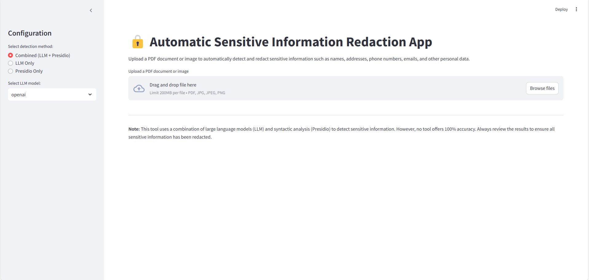
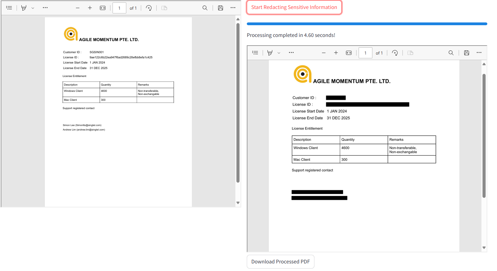

# Redact PII Document

A comprehensive tool for redacting personally identifiable information (PII) from documents using OCR and advanced text processing techniques.

## Overview
This project provides functionality to:

- Extract text from documents using OCR
- Identify and redact PII data
- Convert processed documents to markdown
- Support various document formats

## Installation

### Clone the repository:
```bash
git clone https://github.com/your-repo/redact-pii-document.git
cd redact-pii-document
```

### Install dependencies:
```bash
pip install -r requirements.txt
```

### Set up conda environment (optional):
```bash
conda create --name pii-redaction python=3.10
conda activate pii-redaction
pip install -r requirements.txt
```

## Usage

### Create Env
Use .env_template format

### Run LiteLLM 

Copy .env to deployment/litellm
```bash
cd deployment/litellm && bash run.sh
```
### Run Local LLM (using VLLM for model serving,require cuda>12)

```bash
cd deployment/vllm && bash docker compose -f vllm-docker-compose.yaml up -d
```
### API Access
Use the API script to access functionality:
```bash
python src/api.py --port 8000
```
### Streamlit App
Use the API script to access functionality:
```bash
streamlit run src/app.py
```


**Results Example** :


## Project Structure
```
deployment/     # Deployment configurations for litellm and vllm
src/            # Core source code include ocr processing,llm processing...
```

## Dependencies
See `requirements.txt` for the full list of dependencies.

## License
[Include your license information here]
